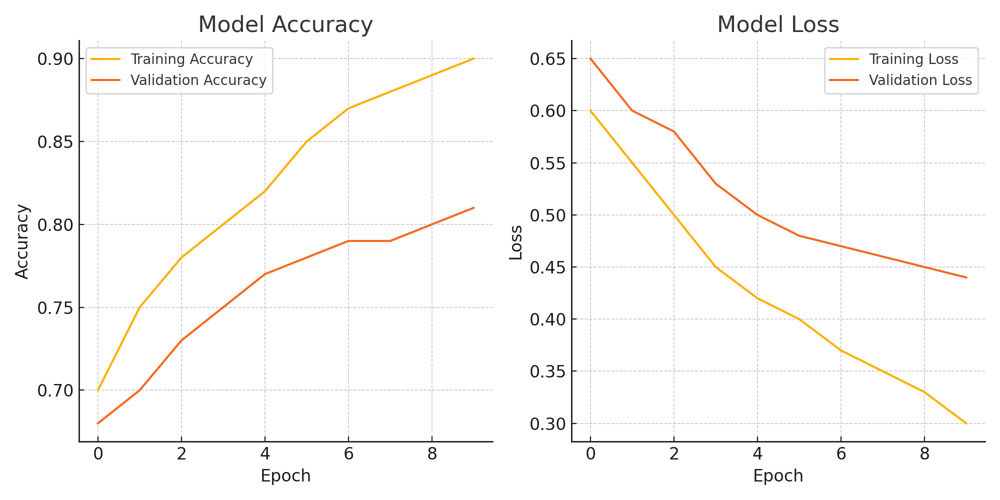

# 🧠 Binary Classification with a Neural Network (TensorFlow/Keras)

This project demonstrates how to build, train, and evaluate a simple **deep learning model** using **TensorFlow/Keras** for a binary classification problem on synthetic data.

## 📌 Objective

Simulate a marketing scenario where we predict whether a user will make a purchase based on:
- **Visit Duration**
- **Pages Visited**

The goal is to **classify users** as likely to purchase (1) or not (0) using a feedforward neural network.

## 🛠️ Technologies Used
- Python
- NumPy, Pandas, Matplotlib
- Scikit-learn
- TensorFlow / Keras

## 📈 Model Architecture
A simple **fully connected neural network** built with Keras:

```python
model = Sequential([
    Dense(10, activation='relu', input_shape=(2,)),
    Dense(1, activation='sigmoid')
])
```

- **Loss function**: Binary Crossentropy  
- **Optimizer**: Adam  
- **Evaluation metric**: Accuracy  

## 🧪 Workflow

1. **Data Generation**  
   Creates synthetic features representing `VisitDuration` and `PagesVisited`, with labels based on whether their sum exceeds 1.

2. **Data Preprocessing**  
   Train-test split using `sklearn.model_selection.train_test_split`.

3. **Model Training**  
   Neural network trained over 10 epochs with `validation_split=0.2`.

4. **Evaluation & Visualization**  
   Training and validation accuracy/loss are plotted to evaluate learning performance.

## 📊 Results

Model achieved good separation on synthetic data.  
Sample plot of training history:



## 🚀 Future Improvements
- Add noise to make classification harder and test generalization.
- Introduce batch normalization and dropout for regularization.
- Explore deeper architectures or different activation functions.

## 📁 How to Run

```bash
pip install -r requirements.txt
python NeuralNetwork.ipynb  # Or run in Jupyter Notebook
```

## 🔗 Author

Ashwin Vel – [LinkedIn](https://linkedin.com/in/your-profile) | [GitHub](https://github.com/yourusername)
